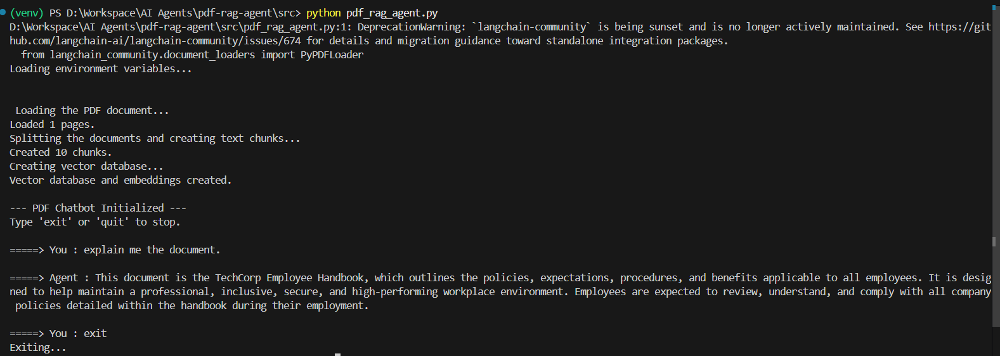
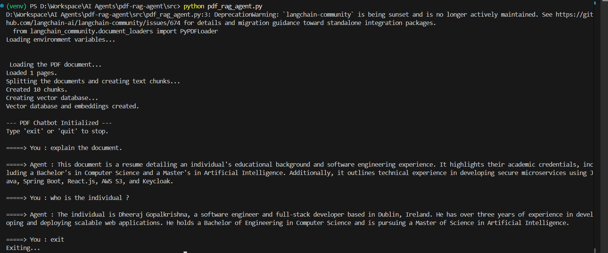
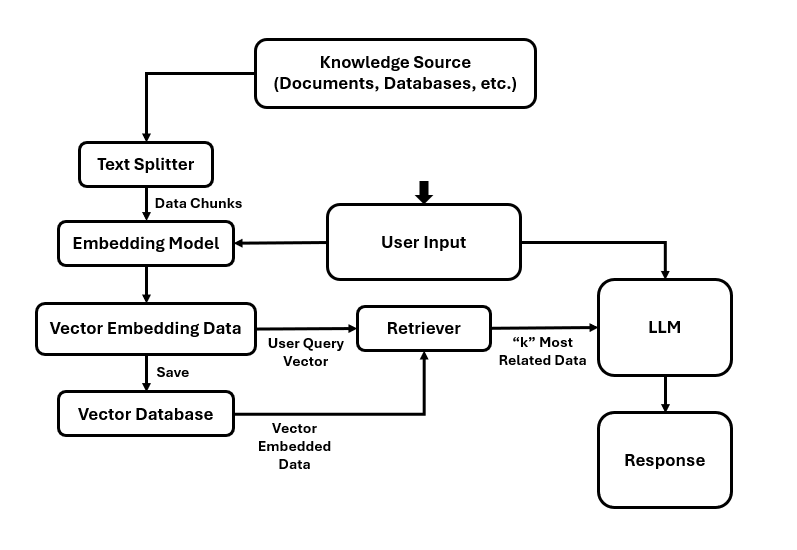

# Document RAG Agent
RAG agent helps in retriving information from document.

## Installation

1. Create a virtual environment.   
``` >> python -m venv venv ```

2. Activate virtual environment.    
``` >> venv\Scripts\activate ```

3. Upgrade **pip**.  
``` >> python -m pip install --upgrade pip ```

4. Install dependencies.  
``` >> pip install langchain langchain-google-genai langchain-community chromadb python-dotenv pypdf ```

5. Create a **.env** file with the API key.    
``` GOOGLE_API_KEY=your_actual_api_key_here ```

6. In the same **.env** file, specify the document path that is to be provided to RAG model.   
``` DOCUMENT_PATH=your_document_path ```

7. **setup.py** has initial configurations and setup.

8. Start the agent.  
``` >> python pdf_rag_agent.pdf ```


## Snapshots




## Architecture


