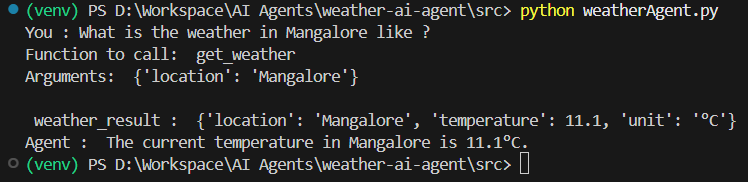
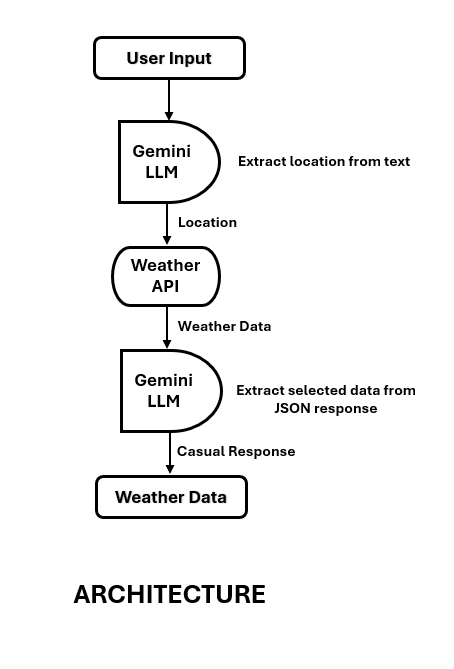

# Steps

1. Create a virtual environment.  
``` >> python -m venv venv ```

2. Activate virtual environment.  
``` >> venv\Scripts\activate ```

3. Install **Google Gen AI, Requests and Python Dotenv** library.  
``` >> pip install google-genai requests python-dotenv ```

4. Create an Environment file **.env** in **/src** with API key.  
``` GEMINI_API_KEY=your_api_key_here ```  

5. Create a Weather Tool to fetch weather data. This is a python code. File : **weather.py**.  

6. Run the agent : ``` >> python weatherAgent.py ```

7. Sample input : ``` >> You : Weather in Mangalore, Karnataka ? ``` 


## Snapshot




## Architecture

